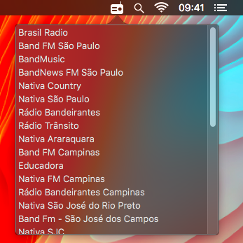
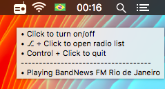

# BandNewsMac
A tiny macOS statusBar app for BandNews Radio ;)

## features
- one click turn it on and off, simple as that :bowtie:
- ⎇ + Click to open radio list
- Control + Click to quit
- An enought tooltip with these commands and info about current radio

## shots
_radio is ON:_  
 

_radio is OFF:_  

_listing available radios:_  

_tooltip helper:_  

## Download
You can download the latest release [here](https://github.com/dbonates/BandNewsMac/releases/download/v1.0/BandNews_1.0.zip).

